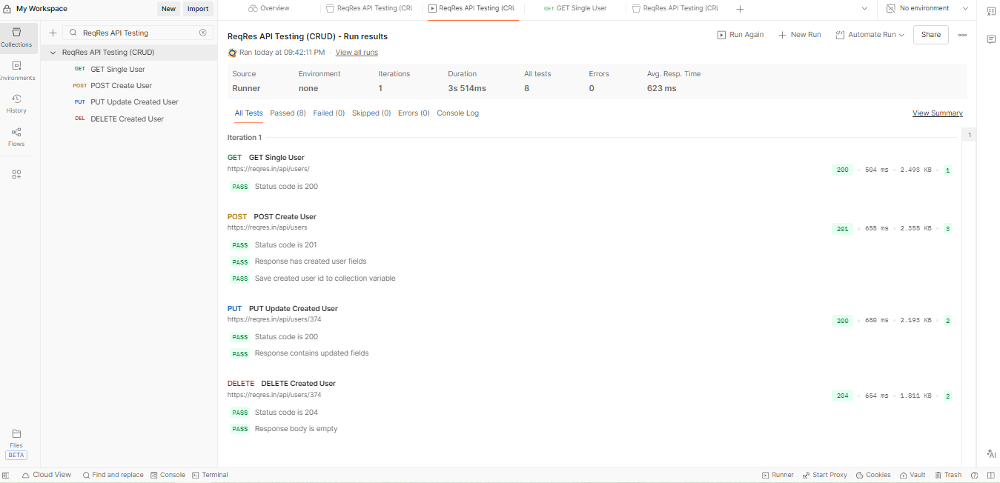

## Project Type
Personal QA Practice Project simulating real-world API testing workflow.

# QA Engineer Portfolio

Hello! My name is Alex Baronas.

This repository demonstrates my QA skills through practical testing projects.

## Skills Demonstrated
- API Testing (Postman)
- Test Case Design
- Bug Reporting
- REST API validation
- Test documentation

## QA Skills
- API Testing
- REST API validation
- Postman
- Test Case Design
- Bug Reporting
- Manual Testing
- Basic JavaScript assertions
- Git & GitHub workflow

---

## Projects

### API Testing — ReqRes CRUD
Postman collection covering:
- GET user
- POST create user
- PUT update user
- DELETE user

Includes automated tests and variable chaining.

📁 See: /API-Testing

---

### Test Cases
Manual test cases designed for User API functionality.

📁 See: /Test-Cases

---

### Bug Reports
Example bug reports created based on API behavior analysis.

📁 See: /Bug-Reports

---

## Test Execution Example

---

## Tools
- Postman
- GitHub
- REST API
- JavaScript (basic assertions)

---

## Goal
Seeking a Junior QA Engineer position to apply testing knowledge in real projects.
